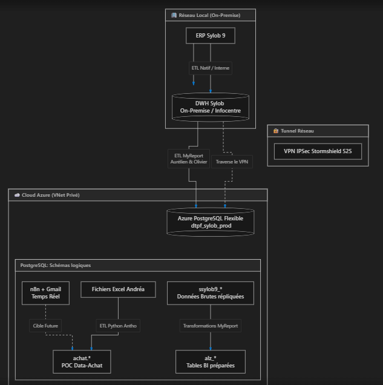
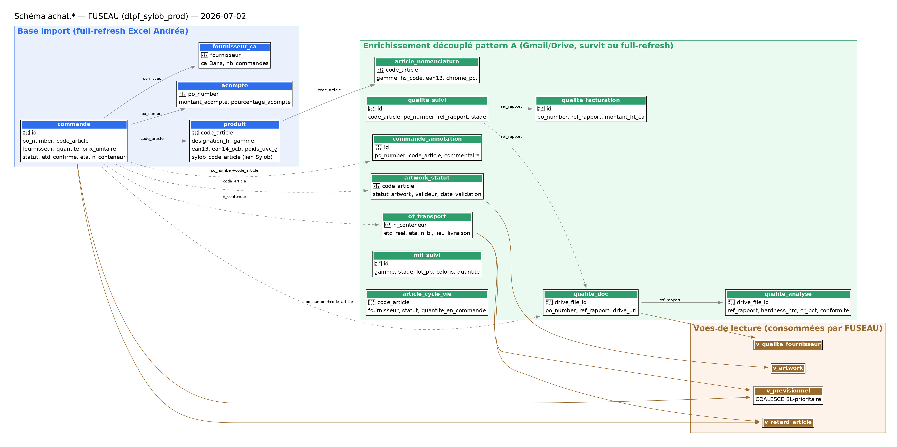

# FUSEAU -- ERP Achat TB Groupe

POC d'ERP Achat (suivi des imports Chine, Circuit B réappro) : ETL Excel/Sylob →
DWH Azure PostgreSQL (`achat.*`), API FastAPI + frontend, alimentation email-first
(Gmail). Projet data analytique en amont du DWH MyReport.

> **Statut :** POC en cours (deadline métier 31/07/2026). Ne pas industrialiser
> avant validation. Coordination : e.georgeon@tb-groupe.fr (Supply Chain).

## Démarrage rapide

```
cd C:\Users\abezille\dev\Data-Achat
pip install -r requirements.txt        # une fois
python run_api.py                       # lance l'ERP -> http://127.0.0.1:5050
```

Laisser la fenêtre ouverte. **VPN Stormshield requis** (accès DWH Azure).
Vérifier avant toute démo : http://127.0.0.1:5050/api/health → `write_enabled: true`.

## Liens utiles

| Ressource | Lien / commande |
|-----------|-----------------|
| ERP FUSEAU (UI) | http://127.0.0.1:5050 |
| Health check | http://127.0.0.1:5050/api/health |
| Workflow n8n PJ Gmail | http://192.168.102.36:5678/workflow/j2HdoDnRAFgG81w2 |
| Plan d'action | `docs/plan_action.md` |
| Runbook OAuth Gmail | `docs/20260622_FUSEAU_RunbookOAuthGmail_v1.md` |

## Commandes

```
python -m src.scripts.etl.pipeline                 # ETL complet (Excel/Sylob -> DWH)
python -m src.scripts.etl.pipeline --dry-run       # extract+transform sans écriture DB
python -m src.scripts.gmail.fetch_attachments --dry-run   # fetch PJ Gmail (Plan A)
pytest src/tests/                                  # tests unitaires Transform
```

## Architecture

Flux de données global TB Groupe (Sylob → DWH On-Premise → Azure PostgreSQL →
`achat.*`) — détail dans `docs/architecture_data.md`.



```
Excel Achats (IMPORT 2026, Matrice, dimensions)  ─┐
Sylob DWH (tarrerias_production_dwh)             ─┼─► ETL Python ─► achat.* (Azure PostgreSQL)
Gmail (PJ fournisseurs : Plan A script / Plan B n8n) ─┘                    │
                                                          API FastAPI + frontend (FUSEAU)
```

- **BDD cible :** `dtpf_sylob_prod`, schéma `achat` (Azure PostgreSQL Flexible).
- **Secrets :** Azure Key Vault (`kv-dtpf-prod`) via `DefaultAzureCredential`, fallback `config/.env`.
- **Clé produit :** code article Sylob ; code provisoire `JJMMAAHHMM` avant création.
- **Tables :** `produit`, `commande`, `commande_annotation` (saisie métier, hors ETL),
  `artwork`, `ot_transport` (suivi maritime par conteneur), vue `v_retard_article`.

## Modèle de données `achat.*`

Schéma visuel daté (généré via Graphviz, 02/07/2026) — dictionnaire complet
des tables dans `docs/modele_semantique.md`.



**Traçabilité de la source des données (décision 02/07) :** pas de lineage
généralisé (disproportionné pour un POC dont la finalité est de disparaître
dans Sylob). Deux mécanismes ciblés :
- Niveau table : colonne `source_fichier` (row-level) sur les tables
  pattern A (`artwork_statut`, `qualite_suivi`, `ot_transport`...).
- Niveau colonne, cas unique `achat.produit` : `source_dimensions` +
  `sylob_dimensions_synced_at` tracent le pull direct Sylob V25
  (packaging/dimensions), distinct du reste de la ligne issu de la Matrice
  Excel. Détail : `docs/modele_semantique.md#traçabilité-de-la-source`.

## Structure

```
app/            API FastAPI (main.py) + accès DB
frontend/       UI statique (index.html) servie par l'API
src/scripts/etl/    extract / transform / load / pipeline / enrich_from_sylob
src/scripts/gmail/  fetch_attachments (Plan A -- PJ Gmail)
src/utils/      config_manager (Config, Key Vault, URL.create)
sql/            DDL (ot_transport...)
deploy/n8n/     workflow n8n (Plan B)
docs/           plan d'action, runbook, analyses Excel
config/         .env (non commité)
```

## Standards

Python 3.11, type hints, `logging` (jamais `print`), config centralisée `Config`,
connexion DB via Key Vault. Code/logs EN, docs/UI FR.
