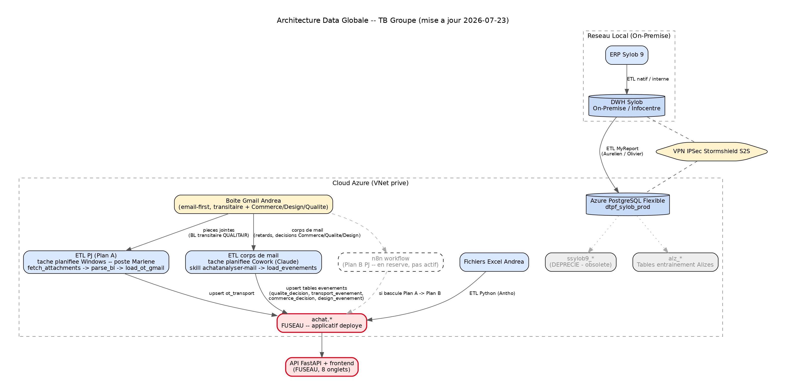
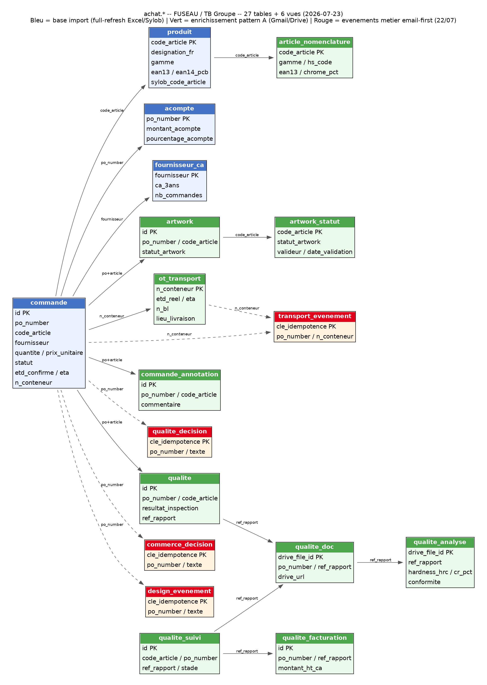

# FUSEAU -- ERP Achat TB Groupe

Dashboard/ERP Achats (suivi des imports Chine, Circuit B réappro) : ETL Excel/Sylob →
DWH Azure PostgreSQL (`achat.*`), API FastAPI + frontend, alimentation email-first
(Gmail). Projet data analytique en amont du DWH MyReport.

> **Statut (23/07/2026) :** mise en prod prévue mardi 27/07 -- utilisatrices :
> Marlène (poste local) + Andréa (accès LAN bureau depuis son propre poste).
> Antho reste en dev sur son poste (localhost uniquement). API tournant en
> Tâche Planifiée Windows (auto-restart), cf. `docs/20260723_FUSEAU_RunbookServiceWindows_v1.md`.
> Dépassé le stade POC (10 onglets opérationnels, cf. section Fonctionnalités).
> Toute nouvelle fonctionnalité prod reste validée avec le métier avant
> généralisation. Coordination : e.georgeon@tb-groupe.fr (Supply Chain),
> Marlène Montbrizon (Responsable Achats).

## Contexte métier

Le service Achats (Andréa) tient un fichier Excel qui concentre une donnée à
forte valeur (fournisseurs, prix, délais, qualité) mais reste un shadow IT
difficile à exploiter en aval (ex. contrôle qualité magasiniers). Le principe
retenu : capter cette donnée **sans imposer de conduite du changement à
Andréa** (elle continue d'utiliser son Excel/gsheet tel quel) tout en la
rendant fiable et interrogeable côté DWH. FUSEAU est le pont provisoire ;
l'objectif final est de réintégrer cette donnée nativement dans Sylob (API en
écriture / champs personnalisés), pas de maintenir un datastore parallèle.

## Fonctionnalités (10 onglets, tous opérationnels)

Dashboard · Commandes · Fournisseurs · Artwork · Prévisionnel (financier) ·
Conteneurs · Promo/Opé · Qualité · Article (fiche 360°) · Fiche Achat (Phase A,
pré-rempli).

Endpoints clés (`app/main.py`) : `/api/kpis`, `/api/commandes` (+ annotation),
`/api/fournisseurs` (+ historique-prix), `/api/produit/{code_article}` (fiche
Article 360°, fusionne produit + nomenclature + artwork + qualité),
`/api/artwork`, `/api/previsionnel` (cash_echeances + par_conteneur),
`/api/conteneurs`, `/api/qualite` (+ fournisseurs), `/api/health`.
Promo/Opé est dérivé côté frontend (filtre `op_client_appro` sur
`/api/commandes`, pas d'endpoint dédié).

Reste à faire (non couvert) : Fiche Achat Phase B (génération PDF/xlsx),
détection non-conformité via mail Eric T, Design System TB pas encore
appliqué au frontend (encore orange maison + Calibri/Segoe UI).

## Démarrage rapide

```
cd C:\Users\abezille\dev\Data-Achat
uv venv --python 3.11 .venv311                                              # une fois
uv pip install --python .venv311\Scripts\python.exe -r requirements.txt -r requirements-gmail.txt
.venv311\Scripts\python.exe run_api.py                                     # lance l'ERP -> http://127.0.0.1:5050
```

Python 3.11 (cible standard, cf. `CLAUDE.md`) via `.venv311` (uv) — migré le
02/07 depuis l'interpréteur global 3.13. `uv` télécharge et gère l'interpréteur
3.11 lui-même, pas besoin de l'installer séparément.

Laisser la fenêtre ouverte (dev). **VPN Stormshield requis** (accès DWH Azure).
Vérifier avant toute démo : http://127.0.0.1:5050/api/health → `write_enabled: true`.

**Poste Marlène (prod) :** ne pas lancer `run_api.py` à la main -- l'API tourne
en Tâche Planifiée Windows (`FUSEAU-API`, auto-restart), installée via
`deploy\install_service_windows.ps1`. Procédure complète, accès LAN Andréa,
logs, dépannage : `docs/20260723_FUSEAU_RunbookServiceWindows_v1.md`.

## Liens utiles

| Ressource | Lien / commande |
|-----------|-----------------|
| ERP FUSEAU (UI) | http://127.0.0.1:5050 |
| Health check | http://127.0.0.1:5050/api/health |
| Workflow n8n PJ Gmail | http://192.168.102.36:5678/workflow/j2HdoDnRAFgG81w2 |
| Plan d'action | `docs/plan_action.md` |
| Runbook OAuth Gmail | `docs/20260622_FUSEAU_RunbookOAuthGmail_v1.md` |
| Déploiement poste Marlène + Gmail | `docs/20260629_FUSEAU_DeploiementPosteMarlene_Cowork_v1.md` |
| Runbook service Windows (prod, accès LAN Andréa) | `docs/20260723_FUSEAU_RunbookServiceWindows_v1.md` |
| Schéma machine-readable `achat.*` | `docs/achat_schema.yaml` |
| Sources gsheet/Drive (artworks, qualité, maritime) | `docs/sources_gsheet_drive.md` |

## Commandes

```
.venv311\Scripts\python.exe -m src.scripts.etl.pipeline                 # ETL complet (Excel/Sylob -> DWH)
.venv311\Scripts\python.exe -m src.scripts.etl.pipeline --dry-run       # extract+transform sans écriture DB
.venv311\Scripts\python.exe -m src.scripts.gmail.fetch_attachments --dry-run   # fetch PJ Gmail (Plan A)
.venv311\Scripts\python.exe -m pytest src\tests -q                     # tests unitaires
```

## Architecture

Flux de données global TB Groupe (Sylob → DWH On-Premise → Azure PostgreSQL →
`achat.*`) — détail dans `docs/architecture_data.md`.



```
Excel Achats (IMPORT 2026, Matrice, dimensions)  ─┐
Sylob DWH (tarrerias_production_dwh)             ─┼─► ETL Python ─► achat.* (Azure PostgreSQL)
Gmail (PJ fournisseurs : Plan A script / Plan B n8n) ─┘                    │
                                                          API FastAPI + frontend (FUSEAU)
```

- **BDD cible :** `dtpf_sylob_prod`, schéma `achat` (Azure PostgreSQL Flexible).
- **Secrets :** Azure Key Vault (`kv-dtpf-prod`) via `DefaultAzureCredential`, fallback `config/.env`.
- **Clé produit :** code article Sylob ; code provisoire `JJMMAAHHMM` avant création.
- **Tables (27) + vues (6) :** `produit`, `commande`, `commande_annotation` (saisie
  métier, hors ETL), `artwork`/`artwork_statut`, `ot_transport` (suivi maritime
  par conteneur), `qualite`/`qualite_doc`/`qualite_analyse`/`qualite_suivi`/
  `qualite_facturation`, 4 tables événements email-first (22/07) --
  `qualite_decision`, `transport_evenement`, `commerce_decision`,
  `design_evenement` --, vues `v_retard_article`/`v_retard_expedition`/
  `v_retard_fournisseur`/`v_previsionnel`/`v_artwork`/`v_qualite_fournisseur`.
  Détail complet : `docs/modele_semantique.md` (généré depuis `docs/achat_schema.yaml`).

## Modèle de données `achat.*`

Schéma visuel daté (généré via Graphviz, 23/07/2026, régénéré depuis
l'introspection live -- `python -m src.scripts.etl.generate_schema_yaml`) —
27 tables + 6 vues, dictionnaire complet dans `docs/modele_semantique.md`.



**Traçabilité de la source des données (décision 02/07) :** pas de lineage
généralisé (la finalité de FUSEAU reste de disparaître dans Sylob à terme).
Deux mécanismes ciblés :
- Niveau table : colonne `source_fichier` (row-level) sur les tables
  pattern A (`artwork_statut`, `qualite_suivi`, `ot_transport`...).
- Niveau colonne, cas unique `achat.produit` : `source_dimensions` +
  `sylob_dimensions_synced_at` tracent le pull direct Sylob V25
  (packaging/dimensions), distinct du reste de la ligne issu de la Matrice
  Excel. Détail : `docs/modele_semantique.md#traçabilité-de-la-source`.

## Structure

```
app/            API FastAPI (main.py, 12 endpoints) + accès DB (database.py)
frontend/       UI statique mono-fichier (index.html, 8 onglets) servie par l'API
src/scripts/etl/    extract / transform / load / pipeline / enrich_from_sylob / generate_schema_yaml
src/scripts/gmail/  fetch_attachments, load_evenements, load_artwork, load_ot_gmail, preflight (Plan A -- PJ Gmail)
src/utils/      config_manager (Config, Key Vault, URL.create), google_auth
sql/            DDL versionné (ot_transport, tables événements 22/07...)
deploy/n8n/     workflow n8n (Plan B)
docs/           plan d'action, runbooks, modèle sémantique, schémas (générés)
config/         .env (non commité)
```

Historique (analyses/déploiements superseded, décisions déjà tranchées et
implémentées) : `05_ARCHIVES/Versions_Anterieures/`.

## Standards

Python 3.11, type hints, `logging` balisé (`[SUCCES]`/`[ECHEC]`/`[ATTENTION]`,
jamais `print` sauf sortie stdout volontaire d'un CLI pipeable), en-têtes
`[TAG]` par fichier, config centralisée `Config`, connexion DB via Key Vault
(cf. skill `standards-dev-antho-tb`). Code/logs EN, docs/UI FR.
