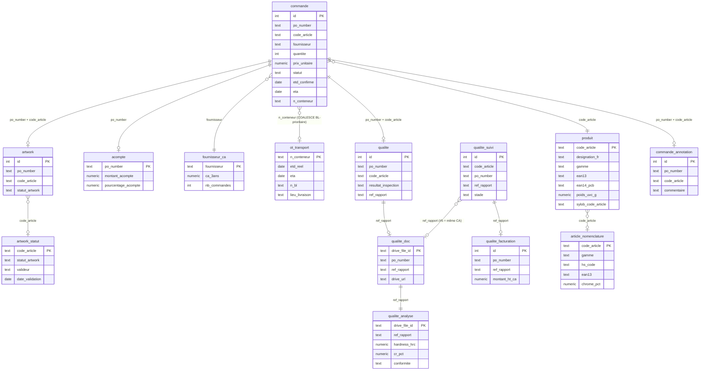

# Modèle sémantique — schéma `achat.*` (DWH Azure `dtpf_sylob_prod`)

> But : comprendre les données, tables et champs qu'on constitue, et servir de **socle
> au mapping vers Sylob** (objectif cible : ramener ces données structurées dans l'ERP).
> Généré à partir de l'introspection du schéma (12 tables + 4 vues au 2026-07-02).
> Colonne « Sylob ? » = à auditer contre `tarrerias_production_dwh` (déjà présent oui/non).

## Zones fonctionnelles

- **Base import** (source IMPORT Excel Andréa, cible Sylob V25) : `commande`, `produit`, `acompte`, `fournisseur_ca`.
- **Enrichissement découplé (pattern A)** — survit au full-refresh, mergé par les vues : `ot_transport`, `artwork_statut`, `qualite_doc`, `qualite_analyse`, `article_nomenclature`, `commande_annotation`.

### Sources gsheet #3/#4/#5 (chargées 2026-07-02, accès direct Drive)
- `ot_transport` : 43 conteneurs (gsheet "SUIVI MARITIME TARRERIAS 2026", source de vérité collaborative transitaire — **ne jamais modifier ces fichiers**, lecture seule). Bug corrigé : `transform_maritime.parse_maritime_date` ne gérait pas le format ISO datetime (`2025-12-28 00:00:00`), seulement l'ancien format texte ("28 December") — 0% de dates avant fix, 100% après. Loader `load_ot_gmail.py` (déjà existant).
- `artwork_statut` : 2 articles (gsheet "Suivi des artworks-import", Clarisse). Les 50 autres lignes = produits sans code_article encore attribué ("PAS DE REF"/`#N/A`), normal, pas un bug. Loader écrit ce jour : `src/scripts/gmail/load_artwork.py` (pattern COALESCE, même modèle que load_ot_gmail).
- `qualite_suivi`/`qualite_facturation` : données récupérées (95 lignes, gsheet "SUIVI DES ANALYSES") mais **`transform_suivi.py` reste à écrire** (jamais codé, seulement profilé) — prochaine étape logique.
- **Vues de lecture** (ce que consomme FUSEAU) : `v_previsionnel`, `v_retard_article`, `v_artwork`, `v_qualite_fournisseur`.

## Schéma visuel (ERD)



**Zones** (mêmes couleurs de regroupement que le drawio Sylob de référence) :
- 🟦 **Base import** (full-refresh Excel Andréa → cible Sylob V25) : `commande`, `produit`, `acompte`, `fournisseur_ca`
- 🟩 **Enrichissement découplé pattern A** (Gmail/Drive, survit au full-refresh) : `ot_transport`, `artwork_statut`, `qualite_doc`, `qualite_analyse`, `qualite_suivi`, `qualite_facturation`, `article_nomenclature`, `commande_annotation`
- Les vues `v_previsionnel`/`v_retard_article`/`v_artwork`/`v_qualite_fournisseur` (non représentées ci-dessus, cf. section Vues) fusionnent les deux zones à la lecture — c'est le contrat FUSEAU/Sylob : le full-refresh écrase la zone bleue sans jamais toucher la zone verte.

*Rendu : ce bloc ```mermaid s'affiche nativement dans VS Code (extension Markdown Preview Mermaid), GitHub/GitLab, et peut être importé dans draw.io (Extras → Edit Diagram → coller en Mermaid) pour retrouver le même style que `Schéma_Modèle_Sementique.drawio`.*

## Dictionnaire des tables

| Table | Rôle | Grain | Clé | Source | Sylob ? |
|-------|------|-------|-----|--------|---------|
| `commande` | Suivi commandes import (cœur) | ligne article × commande | id ; UQ (po_number, code_article) | IMPORT 2025.xlsx | partiel — **oui** : `Achat.f_commandeachat`/`f_lignecommandeachat`/`vue_commande_achat_detail` (société TARRERIAS_SE_TARRERIAS_BONJEAN, V25) |
| `produit` (46 col + 2 traçabilité) | Référentiel produit enrichi | article | code_article | Matrice TB Import.xlsx **+ pull direct Sylob V25** (`enrich_dimensions.py`, packaging/dimensions) — cf. note traçabilité ci-dessous | **oui** (`Article.af_article`, 149 colonnes natives) |
| `acompte` | Acompte versé par PO | PO | po_number | IMPORT (col Acompte) | **non** — aucune table "acompte" dans `Finances`/`Achat` (vérifié V25) ; conditions règlement existent (`a_conditionreglement`) mais pas le montant versé |
| `fournisseur_ca` | CA cumulé 3 ans | fournisseur | fournisseur | Sylob (vue_commande_achat) | **oui** (dérivable de `vue_commande_achat`) |
| `article_nomenclature` | **Nomenclature composant+packaging+gamme+HS** | article | code_article | Matrice TB Import.xlsx | **partiel, largement oui** — voir audit détaillé ci-dessous |
| `ot_transport` | Suivi expédition maritime | conteneur | n_conteneur | SUIVI MARITIME (transitaire) | **non** (aucun concept transport/conteneur dans les schémas audités) |
| `artwork` | Artwork par commande | po × article | UQ (po_number, code_article) | IMPORT | **non** (pas de concept design/artwork ERP) |
| `artwork_statut` | Statut validation design | article | code_article | Suivi artworks (Clarisse) | **non** |
| `qualite` | Qualité par commande | po × article | UQ (po_number, code_article) | IMPORT (MAT/SP/conformité) | **partiel-oui** : `Qualite.f_controlequalitereception`/`vue_controle_qualite_reception` couvre le contrôle réception ; `af_article.sup_rapport_dinspection`/`sup_certificat_matiere` = flags Oui/Non (pas de lien fichier) |
| `qualite_doc` | Index rapports (lien FAIL→fichier) | fichier rapport | drive_file_id | Drive/serveur ANALYSES ET INSPECTIONS | **non** (Sylob n'a que le flag Oui/Non, pas le lien vers le PDF — notre valeur ajoutée reste nécessaire) |
| `qualite_analyse` | Mesures labo (chrome/dureté/conformité) | fichier rapport | drive_file_id | rapports SPECTRO (PDF) | **non** (mesures labo détaillées absentes de Sylob) |
| `commande_annotation` | Notes métier divers (survit full-refresh) | po × article | UQ (po_number, code_article) | saisie FUSEAU / threads Gmail (divers non classé) | non (custom FUSEAU) |
| `qualite_decision` | Décision conforme/non-conforme (email-first, Eric T) | événement | cle_idempotence | threads Gmail (corps) | **non** (email-first ; FNC formel Sylob à réconcilier) |
| `transport_evenement` | Retards / imprévus / changements ETD-ETA-livraison | événement | cle_idempotence | threads Gmail + transitaire | **non** (transport absent de Sylob) |
| `commerce_decision` | Arbitrages commerce (prix client, go/no-go, priorité, promo) | événement | cle_idempotence | threads Gmail (Eric/David) | **non** (informel commerce) |
| `design_evenement` | Validations design (boîte, artwork, marquage, pantone) | événement | cle_idempotence | threads Gmail (Clarisse) | **non** (design absent de Sylob) |
| `mif_suivi` | Bilan Made In France (lames/couteaux par lot PP × coloris) | gamme × stade × lot_pp × coloris | UQ (gamme, stade, lot_pp, coloris) | IMPORT 2026 / POINT MIF (⚠️ copie figée mars 2026) | non |
| `article_cycle_vie` | Cycle de vie articles Carrefour (arrêt/en cours) | article | code_article | IMPORT 2026 / STOP REF CARREFOUR (⚠️ copie figée mars 2026) | non |
| `article_nomenclature_composant` | Détail composant (1..8) pour articles multi-composant | article × position | (code_article, position) | Matrice TB Import / Lot Multiples produits (⚠️ copie figée mars 2026) | non (custom TB) |
| `qualite_suivi` | Suivi analyses labo (blocs A+D) | id | id | Suivi analyses (Gmail/Drive, Andréa) | **non** (mesures labo absentes de Sylob, cf. audit) |
| `qualite_facturation` | Facturation qualité (bloc E) | id | id | Suivi analyses (Gmail/Drive, Andréa) | **non** |

`qualite_suivi` (suivi analyses A+D) et `qualite_facturation` (bloc E) créées en prod le 2026-07-02 (dry-run puis commit validés).

### Traçabilité de la source (niveau table vs niveau colonne)

Principe retenu (02/07, question Antho) : **pas de lineage généralisé** (un
JSONB par champ serait disproportionné pour un POC dont la finalité est de
disparaître dans Sylob). Deux mécanismes suffisent :

- **Niveau table** (colonne *Source* ci-dessus) : chaque table pattern A
  porte une colonne `source_fichier` (row-level) — `artwork_statut`,
  `qualite_suivi`, `qualite_facturation`, `mif_suivi`, `article_cycle_vie`,
  `ot_transport`, `article_nomenclature_composant`. Une ligne = une source
  unique, donc une trace par ligne suffit.
- **Niveau colonne, cas unique `produit`** : depuis `enrich_dimensions.py`
  (02/07), certaines colonnes (`ean14_pcb`, `pcb`, `spcb`, `longueur_pcb_cm`,
  `largeur_pcb_cm`, `hauteur_pcb_cm`, `poids_pcb_kg`) sont écrasées par un
  pull direct Sylob V25 (COALESCE, Sylob gagne si renseigné) alors que le
  reste de la ligne (désignation, gamme, matière...) vient de la Matrice
  Excel. Marqueur dédié : `source_dimensions` (`'sylob_v25'` ou `NULL`) +
  `sylob_dimensions_synced_at` (horodatage). Distinct de `sylob_synced_at`
  (existant, posé par `enrich_from_sylob.py` pour le bloc prix/délai) pour
  ne pas écraser le marqueur d'un autre job d'enrichissement.
  Sql : `sql/20260702_source_dimensions_produit.sql`.

### 🔍 Audit Sylob V25 détaillé (2026-07-02, directive Emmanuelle) — FINDING MAJEUR

Audit mené sur `tarrerias_production_dwh` (192.168.102.41:5432, V25), société `TARRERIAS_SE_TARRERIAS_BONJEAN`, schémas `Achat`/`Article`/`Fournisseur`/`Qualite`/`Concevoir`/`Finances`.

**`article_nomenclature` (packaging/dimensions) est LARGEMENT DÉJÀ DANS SYLOB, peuplé à 84-97%**, via des colonnes `sup_*` custom sur `Article.af_article` (149 colonnes) :
- EAN13 natif (`code_gtin_13`) : 8882/9827 articles (90%)
- EAN14 par niveau packaging (`sup_ean14_pcb`, `sup_ean14_spcb`, `sup_ean14_palette`) : 8219/9827 (84%)
- Quantités par niveau (`sup_pcb`, `sup_spcb`, `sup_colis__couche`, `sup_couche__palette`, `sup_uvc__palette`) : 9512/9827 (97%)
- Dimensions et poids par niveau packaging (`sup_hauteur_/largeur_/longueur_/poids_` × `palette`/`pcb`/`spcb`/`uvc`) : 9512/9827 (97%)
- Code douanier (`sup_code_douanier_us`) : seulement 680/9827 (7%, probablement uniquement produits export US) — **HS code généraliste absent**, à creuser côté GDD/Concevoir
- Gamme/famille commerciale : `Article.a_famillearticle`/`a_grandefamillearticle`/`a_sousfamillearticle` — existe nativement, distinct de `Concevoir.a_gammenomenclature` (gamme de fabrication/BOM, pas gamme commerciale)

**Conséquence directe sur `docs/plan_action.md` #2** (« Base article dimensions volume → `achat.article_dimensions` ») : **ne pas rebâtir un pipeline de capture depuis l'Excel Andréa** — tirer directement `af_article.sup_*` depuis le DWH V25 (déjà sur Azure, déjà peuplé). Change la priorité du plan de captation.

**`Qualite.vue_evaluation_fournisseur`** existe nativement — à comparer avec notre `achat.v_qualite_fournisseur` (risque de duplication, à trancher avec Emmanuelle).

**Manque BI #6 (Détails Qualité/FNC GDD)** : structure causes/défauts existe (`a_causenonconformite`, `a_defautnonconformite`, `f_fichenonconformite`) — la donnée existe potentiellement déjà, à vérifier si alimentée pour GDD.

**Confirmé absent de Sylob** (notre valeur ajoutée réelle) : transport/conteneurs (`ot_transport`), artwork/design, montant acompte, lien fichier rapport qualité (`qualite_doc`/`qualite_analyse` — Sylob n'a qu'un flag Oui/Non, pas le PDF).

Scripts d'audit : `sql/20260702_audit_sylob_af_article.sql`, `sql/20260702_audit_sylob_sample.sql`.

## Vues (lecture / merge)

| Vue | Compose | Logique clé |
|-----|---------|-------------|
| `v_previsionnel` | commande + qualite + **ot_transport** | `COALESCE(ot.etd_reel, c.etd_reel, c.etd_confirme)`, `COALESCE(ot.eta, c.eta)` (BL prioritaire) ; flags acheté/à payer/parti/retard/livré |
| `v_retard_article` | commande + ot_transport | retard figé si livré, sinon `CURRENT_DATE - ETD` |
| `v_artwork` | artwork + **artwork_statut** | statut design prioritaire (`COALESCE` sur code_article) |
| `v_qualite_fournisseur` | qualite | évaluation fournisseur |

## Relations (schéma de jointure)

```
article_nomenclature.code_article ─┐
produit.code_article ──────────────┤
                                    ▼
commande (po_number, code_article) ─┬─ qualite (po_number, code_article)
   │  │                             ├─ artwork (po_number, code_article) ── artwork_statut (code_article)
   │  │                             └─ commande_annotation (po_number, code_article)
   │  └─ code_article ── article_nomenclature / produit
   └─ n_conteneur ── ot_transport (n_conteneur)

qualite / qualite_doc / qualite_analyse ── ref_rapport (CA…)   [suivi analyses #5 = même CA]
fournisseur ── fournisseur_ca ; acompte ── po_number
```

## Maintenance & suite

- Ce document = **modèle sémantique v1** (niveau table). Détail colonnes : DDL `sql/` + `information_schema`.
- ➜ **Proposé** : générer un `achat_schema.yaml` (machine-readable, auto-introspecté) + descriptions, réutilisable par le skill `data-context-extractor` pour donner à Claude le contexte data de TB.
- ➜ **Colonne « Sylob ? »** : à compléter par l'audit `tarrerias_production_dwh` (chaque champ : existe déjà / à migrer) — livrable clé de la revue Emmanuelle et de la cible « ramener dans Sylob ».
